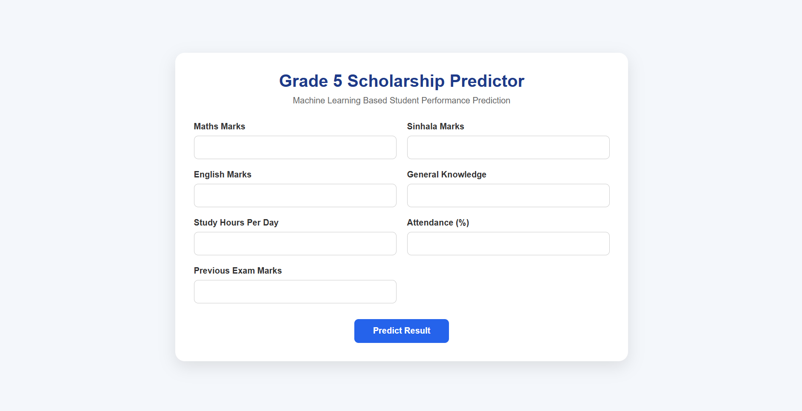

\# Grade 5 Scholarship Prediction System


A machine learning-based web application that predicts a student's Grade 5 Scholarship examination outcome based on academic performance and learning-related factors.


\## Project Overview


The Grade 5 Scholarship Prediction System uses a Random Forest classification model to predict whether a student is likely to receive a "Pass" or "Fail" result based on the information provided.


The system provides a simple web interface where users can enter student details and receive a prediction.


\## Features


\- Student marks input

\- Study hours and attendance input

\- Previous examination marks input

\- Machine learning-based prediction

\- Random Forest classification

\- Model accuracy evaluation

\- Confusion matrix visualization

\- Web-based prediction interface


## 🖥️ Application Screenshot

The following screenshot shows the web interface of the Grade 5 Scholarship Prediction System.




\## Technologies Used


\- Python

\- Pandas

\- Scikit-learn

\- Random Forest

\- Matplotlib

\- Flask

\- HTML

\- CSS

\- Joblib


\## Input Features


The model uses the following features:


\- Mathematics Marks

\- Sinhala Marks

\- English Marks

\- General Knowledge Marks

\- Study Hours per Day

\- Attendance Percentage

\- Previous Examination Marks


\## Machine Learning Model


The system uses a Random Forest Classifier from Scikit-learn.


The dataset is divided into training and testing sets. The trained model is saved as a `.pkl` file using Joblib and later loaded by the Flask web application for predictions.


\## Project Structure


```text

Grade5-Scholarship-Prediction/

│

├── dataset/

│   └── students.csv

│

├── model/

│   ├── scholarship\_model.pkl

│   └── confusion\_matrix.png

│

├── src/

│   ├── train\_model.py

│   ├── predict.py

│   └── evaluate\_model.py

│

├── templates/

│   └── index.html

│

├── app.py

├── requirements.txt

└── README.md

